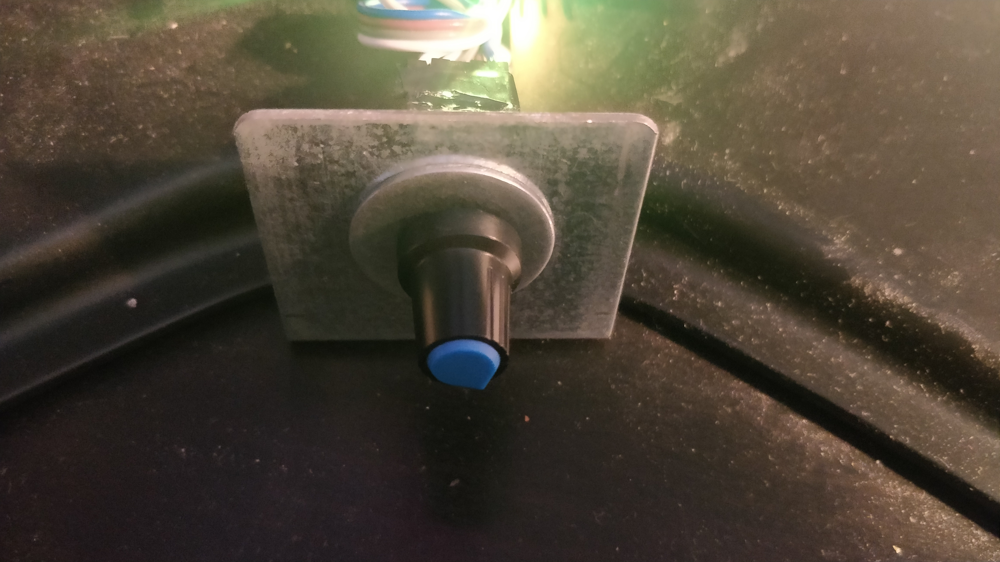
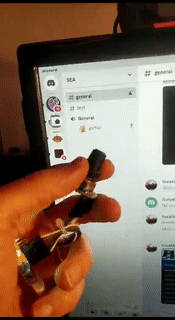

Have you ever connected your pc to a decent amplifier with 120W waffles?
Have you also noticed how big and keep-away thing is the amplifier, and you ONLY touch the volume?

---------PROBLEM SOLVED---------
USB volume+mute *1

*1 Limited offer: now with annoying RGB!!

This shit uses generic keyCodes, all-compatible:

Also this:

How to:
- Buy a rp2040 based microcontroller, and a S1,S2,Key encoder. Maybe cables too!
- The project is set to: rp2040 Zero
- open project, compile, upload the resulting ef2 file from: [project folder].pio\build\pico\firmware.elf
- done

Wiring:

#see
- int S1_pin = 29;
- int S2_pin =28;
- int mykey = 27 ;

#see
- 0v-to-0v
- 5v-to-5v

Btw: this is a vscode+plarform.io project, Mandril!!!
